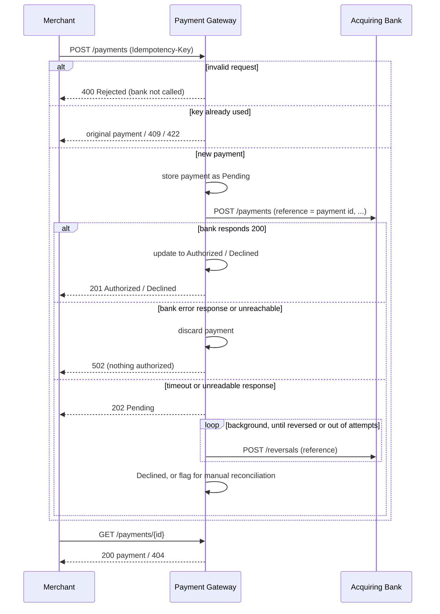

# Payment Gateway

A payment gateway API built with Spring Boot. Merchants use it to process card payments through an acquiring bank and to look up those payments afterwards.

- [Running it](#running-it)
- [API](#api)
- [How it works](#how-it-works)
- [Design decisions and assumptions](#design-decisions-and-assumptions)
- [Observability](#observability)
- [Testing](#testing)
- [What I'd do next](#what-id-do-next)

## Running it

**Requirements:** JDK 17 and Docker.

| What | Command |
|---|---|
| Everything in Docker (gateway and bank simulator) | `docker compose up --build` |
| Gateway locally, simulator in Docker | `docker compose up bank_simulator`, then `./gradlew bootRun` |
| Build and run all tests | `./gradlew build` |

The gateway listens on **http://localhost:8090**. Interactive API docs (Swagger UI) are at **http://localhost:8090/swagger-ui/index.html**.

The simulator decides the outcome from the last digit of the card number:

| Last digit | Result |
|---|---|
| 1, 3, 5, 7, 9 | Authorized |
| 2, 4, 6, 8 | Declined |
| 0 | Bank error |

```bash
curl -i -X POST localhost:8090/payments -H 'Content-Type: application/json' -d '{
  "card_number": "2222405343248877", "expiry_month": 4, "expiry_year": 2030,
  "currency": "GBP", "amount": 100, "cvv": "123" }'
```

## API

| Method | Path | Purpose |
|---|---|---|
| `POST` | `/payments` | Process a payment |
| `GET` | `/payments/{id}` | Retrieve a payment |

### Process a payment: `POST /payments`

Request:

```json
{
  "card_number": "2222405343248877",
  "expiry_month": 4,
  "expiry_year": 2030,
  "currency": "GBP",
  "amount": 100,
  "cvv": "123"
}
```

Validation rules:

| Field | Rule |
|---|---|
| `card_number` | Required. 14-19 digits only |
| `expiry_month` | Required. Between 1 and 12 |
| `expiry_year` | Required. Month and year together must not be in the past |
| `currency` | Required. One of `USD`, `GBP`, `EUR` |
| `amount` | Required. A positive whole number in minor units (`1050` means 10.50) |
| `cvv` | Required. 3-4 digits only |

Response when the bank authorizes or declines the payment: **`201 Created`**, with a `Location: /payments/{id}` header and this body.

```json
{
  "id": "fa35609c-b0a0-4d2f-ace7-7526753167ba",
  "status": "Authorized",
  "card_number_last_four": "8877",
  "expiry_month": 4,
  "expiry_year": 2030,
  "currency": "GBP",
  "amount": 100
}
```

The same shape comes back for a declined payment, with `"status": "Declined"`.

If the bank doesn't answer in time, the response is **`202 Accepted`** with `"status": "Pending"` (see [Retries and unknown outcomes](#retries-and-unknown-outcomes)). Poll the `Location` URL for the final status.

#### Safe retries: the `Idempotency-Key` header

The `Idempotency-Key` header is optional; a V4 UUID works well. It makes retries safe after a timeout or a network error, following [Checkout.com's idempotency rules](https://www.checkout.com/docs/developer-resources/api/idempotency).

| Situation | Response |
|---|---|
| The same key and payment are sent again | The original payment, in its current state. The bank is not called again |
| The same key is sent while the original request is still running | `409 Conflict`. Retry a little later |
| The same key is used for a different payment | `422 Unprocessable Entity` |
| The original request failed (`400`, `502`) | The key is not used up, so the retry is processed normally |

### Retrieve a payment: `GET /payments/{id}`

Returns the same body as above with **`200 OK`**, or **`404 Not Found`** if no payment has that id.

### Status codes

| HTTP status | Meaning | Body |
|---|---|---|
| `201 Created` | The bank **Authorized** or **Declined** the payment, and it was stored | Payment |
| `202 Accepted` | The bank didn't answer, so the payment is **Pending** and being reversed | Payment |
| `200 OK` | Payment found | Payment |
| `400 Bad Request` | The payment was **Rejected** as invalid. The bank was not called and nothing was stored | `{"status":"Rejected","message":"Invalid payment request","errors":["cvv must be 3-4 digits"]}` |
| `404 Not Found` | No payment with that id | `{"message":"Payment not found"}` |
| `409 Conflict` | A request with the same `Idempotency-Key` is still being processed | `{"message":"A request with this Idempotency-Key is still being processed"}` |
| `422 Unprocessable Entity` | The `Idempotency-Key` was already used for a different payment | `{"message":"This Idempotency-Key was already used for a different payment"}` |
| `502 Bad Gateway` | The bank returned an error or couldn't be reached, so nothing was authorized. No payment was kept and it is safe to retry | `{"message":"Acquiring bank unavailable, please retry later"}` |

Every response carries an `X-Request-Id` header. If the merchant sends one, it is echoed back; otherwise the gateway generates one. The same id appears in every log line for that request.

## How it works



Code layout, under `com.checkout.payment.gateway`:

| Package | Contents |
|---|---|
| `controller` | HTTP endpoints and OpenAPI annotations. No business logic |
| `service` | The payment flow: idempotency check, store the payment as Pending, call the bank, record the outcome. `PaymentReversalJob` reverses payments whose outcome is unknown |
| `client` | `BankClient` and the bank's own request/response format. The bank's contract is kept separate from ours. It also decides whether a failure means "nothing authorized" or "outcome unknown" |
| `validation` | The "expiry date is in the future" rule. It uses an injected `Clock`, so tests can control the date |
| `exception` | Maps exceptions to the HTTP responses in the status code table |
| `repository` | In-memory, thread-safe payment store (a `ConcurrentHashMap`) |
| `filter` | Assigns a request id to every request for log correlation |

## Design decisions and assumptions

### API design

- **One resource, `/payments`.** `POST` creates a payment and `GET /payments/{id}` reads it. The POST response and the GET response have the same shape: both are simply "the payment".
- **Field names are snake_case**, the same style as the bank simulator and Checkout.com's public API.
- **`201 Created` for both Authorized and Declined.** A declined payment is still a payment that was created. Its outcome is in `status`, not in the HTTP code.
- **Rejected payments get `400` and are never stored.** The spec says no payment is created when information is invalid. The response says `"status": "Rejected"` and lists every validation error at once, using the merchant's own field names, so they can fix everything in one go.
- **Bank failures get `502 Bad Gateway`.** The gateway itself is healthy; the service behind it failed. The response is distinct from Declined, so a merchant never mistakes "the bank was down" for "the card was refused".
- **Payment ids are random UUIDs.** They can't be guessed or enumerated. An id that isn't a valid UUID returns `404` rather than `400`, because either way no payment exists at that URL.

### Retries and unknown outcomes

When a call to the bank fails, the gateway first asks whether the bank could have authorized the payment anyway.

| What happened | Could the bank have authorized? | What the gateway does |
|---|---|---|
| The bank answered `200` | Yes, and we know the answer | Authorized or Declined (`201`) |
| The bank answered with an error status, or couldn't be reached at all | No | Discards the payment and returns `502`. Retrying is safe |
| The request was sent but no readable answer came back (timeout, connection reset, unreadable body) | **Maybe** | Keeps the payment **Pending** (`202`) and reverses it in the background |

When in doubt, the gateway assumes the bank might have authorized the payment. A reversal for a payment the bank never saw does no harm. A missed reversal leaves money held on the shopper's card.

How this works, as in real gateways:

- **The payment is stored as Pending before the bank is called.** Our payment id goes to the bank as the `reference`, so the payment can be identified later even if no response ever arrives.
- **Timeout reversal.** `PaymentReversalJob` sends `POST /reversals {"reference": ...}` to the bank, retrying every `bank.reversal-retry-interval`:
  - If the reversal succeeds, the payment becomes **Declined** and no money is held.
  - After `bank.reversal-max-attempts` failures, it stays **Pending**. An ERROR log and the `payments_reversals_total{outcome="failed"}` metric flag it for **manual reconciliation** against the bank's settlement report.
- **Idempotency keys** let the merchant retry safely. A retry after a timeout returns the Pending payment, and later its final status, instead of charging again.
  - The key is reserved atomically together with the Pending payment, so two simultaneous duplicates can't both reach the bank.
  - Since the card number and CVV are never stored, a retry is recognised as "the same payment" by its last four digits, expiry, currency and amount.

### Card data and security

- **The full card number and CVV are never stored, returned or logged.**
  - Only the last four digits are kept, as a string, so a leading zero survives (`"0123"`).
  - The request objects override `toString()` to mask card data, because RestTemplate prints request bodies when debug logging is on.
  - Validation errors never repeat the rejected value back to the merchant.
- **Fractional amounts are rejected.** By default, Jackson would silently turn `10.5` into `10`, so this is switched off (`accept-float-as-int=false`).
- **A client-supplied `X-Request-Id` is accepted only if it is safe.** It must match `[A-Za-z0-9-]{1,64}`, because it is written into the logs and could otherwise be used to forge log lines.

### Assumptions

- **Expiry date.** A card is valid until the end of its expiry month, so the current month is accepted. "Now" is taken in UTC.
- **Currencies.** The spec allows at most three ISO codes, so I chose `USD`, `GBP` and `EUR`. They must be uppercase.
- **Amount.** It must be a positive whole number of minor units, so `0` is rejected. It is stored as an `int`, which is enough for this exercise.
- **No Luhn check.** The spec doesn't ask for one, and it could reject the simulator's test card numbers.
- **The bank's reply is the only source of truth.**
  - A `200` from the bank with `authorized: true` means Authorized, and `authorized: false` means Declined.
  - Timeouts: 2 seconds to connect, 10 seconds to read. Both can be configured.
- **The reversal API is assumed.** The simulator only implements `POST /payments`, so I assumed the bank accepts:
  - a `reference` field on payments, which the simulator ignores;
  - reversals at `POST /reversals {"reference": ...}`.
  
  Against the simulator, reversals fail and end in manual reconciliation. A timeout never happens with the simulator unless it is forced, for example with `BANK_READ_TIMEOUT=1ms`.
- **Idempotency keys are global and never expire.** In production they would be scoped to each merchant and expire after a while (Checkout.com uses 72 hours).
- **Storage is in memory, as the spec allows.** Payments are lost on restart and aren't shared between instances.
- **Merchant authentication is out of scope.**

## Observability

| Signal | Where |
|---|---|
| Liveness and readiness | `/actuator/health/liveness`, `/actuator/health/readiness`. These suit Kubernetes probes and the Docker `HEALTHCHECK` |
| Build and version info | `/actuator/info` |
| Metrics, in Prometheus format | `/actuator/prometheus` (see below) |
| Logs | Every log line includes the request id, e.g. `INFO [smoke-test-1] ... Payment fa35609c... Authorized: 100 GBP` |

Metrics:
- `payments_processed_total{status="Authorized", "Declined" or "Pending"}` counts outcomes, to track the authorization rate. A rise in `Pending` means the bank is timing out.
- `payments_reversals_total{outcome="reversed" or "failed"}` counts reversals. **Alert on `failed`**: each one is a payment that needs manual reconciliation.
- `http_server_requests_seconds` gives our own latency and error rate, broken down by status code. Rejections show up here as `400`s.
- `http_client_requests_seconds` gives the bank's latency and its error responses.

Log levels:
- **INFO** for payment outcomes, rejections and idempotent replays. These are expected events.
- **WARN** for unknown bank outcomes and failed reversal attempts.
- **ERROR**, with the stack trace, for bank failures and payments that need manual reconciliation. These need attention.

## Testing

`./gradlew build` runs 73 tests in five classes.

| Test class | Type | What it covers |
|---|---|---|
| `PaymentGatewayControllerTest` | Full Spring context with MockMvc. Only `BankClient` is mocked | The API contract: status codes, JSON field names, the `Location` header, a POST followed by a GET, every validation rule and its boundaries, malformed JSON, fractional amounts, `502` on bank failure, `202` Pending on unknown outcomes, idempotent replay and `422` on key reuse, and the request id. It also checks that card data never appears in a response |
| `BankClientTest` | `MockRestServiceServer` | The exact JSON sent to the bank (reference, snake_case, zero-padded `MM/YYYY` expiry), the reversal call, and sorting each failure into the right group: error statuses and "connection refused" mean nothing was authorized; timeouts and unreadable bodies mean the outcome is unknown |
| `PaymentGatewayServiceTest` | Plain unit test | Pending is stored before the bank call, status mapping, only the last four digits are stored, unknown outcomes schedule a reversal, and the idempotency rules: replay, replay of a Pending payment, `409` for a duplicate in progress, `422` on reuse, and the key being released after a `502` |
| `PaymentReversalJobTest` | Plain unit test | A reversal moves the payment to Declined and is never sent twice; failures are retried; after the maximum attempts the payment stays Pending and the `failed` metric goes up |
| `FutureExpiryDateValidatorTest` | Plain unit test with a fixed `Clock` | Expiry boundaries: the current month is valid and the previous month is not |

The whole system was also checked by hand with `docker compose up` against the real simulator:
- A card ending in an odd digit came back Authorized.
- An even digit came back Declined.
- A card ending in 0 gave a `502`.
- An invalid card number was Rejected.
- Idempotency:
  - Retrying with the same key returned the same payment, and the bank was called once.
  - Reusing a key with a different amount gave `422`.
  - A key used on a request that failed with `502` could be used again.
- Unknown outcome, forced with a second gateway running `BANK_READ_TIMEOUT=1ms`:
  - The payment came back `202` Pending, and a retry with the same key returned it.
  - The reversal job then retried and flagged the payment for manual reconciliation, because the simulator has no reversal endpoint.

## Packaging and CI

- **Dockerfile.** Built in two stages:
  1. A JDK image builds the jar, with Gradle's cache kept between builds.
  2. The jar runs on a slim JRE image as a non-root user, with a health check.
  
  The JVM is sized from the container's memory limit (`MaxRAMPercentage`).
- **Configuration through environment variables.** For example, `BANK_URL` points the gateway at the bank; Compose sets it to the simulator's container.
- **GitHub Actions** (`.github/workflows/build.yml`) builds, runs the tests and builds the Docker image on every push and pull request.

## What I'd do next

These would come before production, roughly in priority order:

1. **A real database** in place of the in-memory store, plus merchant authentication, so merchants can only see their own payments.
   - Idempotency keys would become a unique `(merchant_id, key)` constraint and expire after a set period.
   - The reversal queue would become the Pending rows themselves, so a restart can't lose a reversal.
2. **Webhooks**, so merchants learn when a Pending payment becomes final without polling.
3. **Daily reconciliation** against the bank's settlement files, to catch anything that is still Pending or doesn't match.
4. **Resilience.** Add a circuit breaker and bulkhead around the bank call, and back off exponentially between reversal attempts.
5. **Better telemetry.** Add OpenTelemetry tracing that passes trace context on to the bank, write logs as JSON, and serve actuator endpoints on a separate management port.
6. **API versioning**, such as `/v1/payments`. Possibly also standard error bodies following RFC 7807 (Problem Details), and reason codes on declines.
