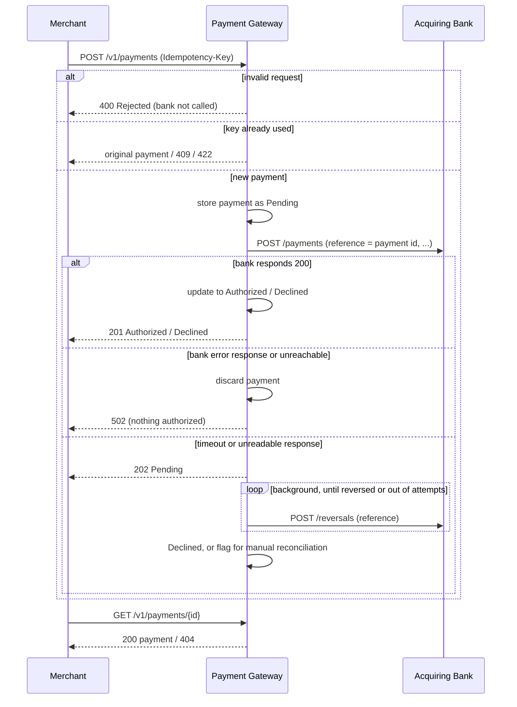

# Payment Gateway

A payment gateway API built with Spring Boot. Merchants use it to process card payments through an acquiring bank and to look up those payments afterwards.

- [Running it](#running-it)
- [API](#api)
- [Merchant authentication](#merchant-authentication)
- [Versioning and errors](#versioning-and-errors)
- [How it works](#how-it-works)
- [Design decisions and assumptions](#design-decisions-and-assumptions)
- [Observability](#observability)
- [Testing](#testing)
- [What I'd do next](#what-id-do-next)

## Running it

**Requirements:** JDK 17 and Docker.

Set local development credentials before starting Compose (PowerShell):

```powershell
$env:POSTGRES_PASSWORD = "local-only-change-me"
$env:GATEWAY_ADMIN_API_KEY = "local-only-admin-key"
```

The admin key provisions merchant keys and is not used for payment requests. Use a strong secret outside local development.

| What | Command |
|---|---|
| Everything in Docker (gateway, bank simulator, PostgreSQL and Jaeger) | `docker compose up --build` |
| Gateway locally, database and simulator in Docker | `docker compose up postgres bank_simulator`, then `./gradlew bootRun` |
| Build and run all tests (unit, integration, coverage gate) | `./gradlew build` |
| Integration tests only | `./gradlew integrationTest` |
| Load test against the full stack | `docker compose --profile perf run --rm k6` |

The gateway listens on **http://localhost:8090**. Interactive API docs (Swagger UI) are at **http://localhost:8090/swagger-ui/index.html**. Actuator endpoints are on a separate management port, **http://localhost:8091/actuator**, and traces are in Jaeger at **http://localhost:16686** (see [Observability](#observability)). The simulator decides the outcome from the last digit of the card number:

| Last digit | Result |
|---|---|
| 1, 3, 5, 7, 9 | Authorized |
| 2, 4, 6, 8 | Declined |
| 0 | Bank error |

```powershell
$adminHeaders = @{ "X-Gateway-Admin-Key" = $env:GATEWAY_ADMIN_API_KEY }
$merchant = Invoke-RestMethod -Method Post `
  -Uri http://localhost:8090/admin/merchants/demo/api-keys -Headers $adminHeaders

curl.exe -i -X POST http://localhost:8090/v1/payments `
  -H "X-API-Key: $($merchant.api_key)" -H "Content-Type: application/json" `
  --data-raw '{"card_number":"2222405343248877","expiry_month":4,"expiry_year":2030,"currency":"GBP","amount":100,"cvv":"123"}'
```

## API

| Method | Path | Purpose |
|---|---|---|
| `POST` | `/v1/payments` | Process a payment |
| `GET` | `/v1/payments/{id}` | Retrieve a payment |
| `POST` | `/admin/merchants/{merchantId}/api-keys` | Provision a merchant key (admin key required) |
| `POST` | `/admin/merchants/{merchantId}/api-keys/{keyId}/rotate` | Revoke a key and issue a replacement |
| `DELETE` | `/admin/merchants/{merchantId}/api-keys/{keyId}` | Revoke a merchant key |

`/payments` and `/payments/{id}` remain available as compatibility aliases. New integrations should use `/v1/payments`.

### Merchant authentication

Every payment request requires an `X-API-Key`. Provisioning, rotation, and revocation require the separate `X-Gateway-Admin-Key`, configured through `GATEWAY_ADMIN_API_KEY`. Provisioning returns a randomly generated 256-bit key once; only its SHA-256 hash and short prefix are stored. Keys expire after one year by default. Rotation revokes the old key and returns its replacement once; revoked or expired keys stop working immediately.

Payment lookup and idempotency are scoped to the authenticated merchant; a payment owned by another merchant is indistinguishable from a missing payment. The admin key should be held by a trusted operator and rotated through deployment secret management.

### Versioning and errors

`/v1/payments` returns RFC 7807 Problem Details with `Content-Type: application/problem+json` for errors. Validation details are included in the `errors` extension. The unversioned compatibility routes retain their existing error JSON shape.

### Process a payment: `POST /v1/payments`

Request:

```json
{
  "card_number": "2222405343248877",
  "expiry_month": 4,
  "expiry_year": 2030,
  "currency": "GBP",
  "amount": 100,
  "cvv": "123"
}
```

Validation rules:

| Field | Rule |
|---|---|
| `card_number` | Required. 14-19 digits only |
| `expiry_month` | Required. Between 1 and 12 |
| `expiry_year` | Required. Month and year together must not be in the past |
| `currency` | Required. One of `USD`, `GBP`, `EUR` |
| `amount` | Required. A positive whole number in minor units (`1050` means 10.50) |
| `cvv` | Required. 3-4 digits only |

Response when the bank authorizes or declines the payment: **`201 Created`**, with a `Location: /v1/payments/{id}` header and this body.

```json
{
  "id": "fa35609c-b0a0-4d2f-ace7-7526753167ba",
  "status": "Authorized",
  "card_number_last_four": "8877",
  "expiry_month": 4,
  "expiry_year": 2030,
  "currency": "GBP",
  "amount": 100
}
```

The same shape comes back for a declined payment, with `"status": "Declined"`.

If the bank doesn't answer in time, the response is **`202 Accepted`** with `"status": "Pending"` (see [Retries and unknown outcomes](#retries-and-unknown-outcomes)). Poll the `Location` URL for the final status.

#### Safe retries: the `Idempotency-Key` header

The `Idempotency-Key` header is optional; a V4 UUID works well. It makes retries safe after a timeout or a network error, following [Checkout.com's idempotency rules](https://www.checkout.com/docs/developer-resources/api/idempotency). Keys are scoped to the merchant and retained for 72 hours by default, after which the same value may start a new payment.

| Situation | Response |
|---|---|
| The same merchant sends the same key and payment again | The original payment, in its current state. The bank is not called again |
| The same merchant sends the key while the original request is still running | `409 Conflict`. Retry a little later |
| The same merchant uses the key for a different payment | `422 Unprocessable Entity` |
| The original request failed (`400`, `502`) | The key is not used up, so the retry is processed normally |

### Retrieve a payment: `GET /v1/payments/{id}`

Returns the same body as above with **`200 OK`**, or **`404 Not Found`** if no payment has that id.

### Status codes

| HTTP status | Meaning | Body |
|---|---|---|
| `201 Created` | The bank **Authorized** or **Declined** the payment, and it was stored | Payment |
| `202 Accepted` | The bank didn't answer, so the payment is **Pending** and being reversed | Payment |
| `200 OK` | Payment found | Payment |
| `401 Unauthorized` | `X-API-Key` is missing, invalid, revoked, or expired | Problem Details on `/v1`; legacy error JSON on `/payments` |
| `400 Bad Request` | The payment was **Rejected** as invalid. The bank was not called and nothing was stored | Problem Details on `/v1`, including an `errors` extension; legacy error JSON on `/payments` |
| `404 Not Found` | No payment with that id | Problem Details on `/v1`; legacy error JSON on `/payments` |
| `409 Conflict` | A request with the same `Idempotency-Key` is still being processed | Problem Details on `/v1`; legacy error JSON on `/payments` |
| `422 Unprocessable Entity` | The `Idempotency-Key` was already used for a different payment during its retention period | Problem Details on `/v1`; legacy error JSON on `/payments` |
| `429 Too Many Requests` | The merchant already has too many payments in progress. Nothing was stored; retry after the `Retry-After` delay | Problem Details on `/v1`; legacy error JSON on `/payments` |
| `502 Bad Gateway` | The bank returned an error or couldn't be reached, so nothing was authorized. No payment was kept and it is safe to retry | Problem Details on `/v1`; legacy error JSON on `/payments` |

Every response carries an `X-Request-Id` header. If the merchant sends one, it is echoed back; otherwise the gateway generates one. The same id appears in every log line for that request.

### Daily settlement reconciliation

At 02:00 UTC, the reconciliation job looks for the previous day's file at `BANK_RECONCILIATION_DIRECTORY/settlement-YYYY-MM-DD.csv`. The expected header is `reference,amount,currency,status`; statuses are `AUTHORIZED`, `DECLINED`, and `PENDING`. The job compares every row with payments created that UTC day, records the report and discrepancies in PostgreSQL, and logs each issue. The CSV adapter is provisional because the simulator does not provide a settlement feed; replace it with the acquiring bank's published format when available.

In Compose, settlement files go in `./settlements` on the host. The directory is mounted read-only into the gateway container. Unprocessed earlier files are retried on each daily run, so a corrected invalid or late report is picked up automatically.

## How it works



Code layout, under `com.checkout.payment.gateway`:

| Package | Contents |
|---|---|
| `controller` | Versioned and compatibility payment endpoints, plus admin credential lifecycle endpoints |
| `service` | Payment flow, merchant credential provisioning/rotation/revocation, stale-authorization recovery, persisted reversal retries, and scheduled settlement reconciliation |
| `client` | `BankClient` and the bank's own request/response format, protected by a circuit breaker and bulkhead |
| `validation` | The "expiry date is in the future" rule. It uses an injected `Clock`, so tests can control the date |
| `exception` | Maps legacy payment errors and versioned/admin errors to their documented formats |
| `repository` | PostgreSQL payment and credential stores, expiring idempotency reservations, and transactional reconciliation reports |
| `filter` | Assigns request ids and authenticates merchant/admin credentials |

## Design decisions and assumptions

### API design

- **Versioned resource, `/v1/payments`.** `POST` creates a payment and `GET /v1/payments/{id}` reads it. The unversioned `/payments` routes remain compatibility aliases.
- **Field names are snake_case**, the same style as the bank simulator and Checkout.com's public API.
- **`201 Created` for both Authorized and Declined.** A declined payment is still a payment that was created. Its outcome is in `status`, not in the HTTP code.
- **Rejected payments get `400` and are never stored.** The spec says no payment is created when information is invalid. The response says `"status": "Rejected"` and lists every validation error at once, using the merchant's own field names, so they can fix everything in one go.
- **Bank failures get `502 Bad Gateway`.** The gateway itself is healthy; the service behind it failed. The response is distinct from Declined, so a merchant never mistakes "the bank was down" for "the card was refused".
- **Payment ids are random UUIDs.** They can't be guessed or enumerated. An id that isn't a valid UUID returns `404` rather than `400`, because either way no payment exists at that URL.

### Persistence and merchant isolation

- PostgreSQL stores payments, merchant ownership, idempotency keys, and reversal retry state. Flyway applies versioned schema migrations.
- A unique `(merchant_id, idempotency_key)` reservation table reserves keys atomically, allows different merchants to use the same key, and expires reservations after 72 hours by default.
- Merchant API keys are generated by the admin API, returned only at issue/rotation, and stored as SHA-256 hashes. The bootstrap admin key is supplied through `GATEWAY_ADMIN_API_KEY`; payment reads always include the authenticated merchant id in the query.
- A stale in-flight authorization is treated as an unknown outcome after the configured bank timeouts plus a grace period. The recovery job turns it into durable reversal work so a process restart cannot strand it.

### Retries and unknown outcomes

When a call to the bank fails, the gateway first asks whether the bank could have authorized the payment anyway.

| What happened | Could the bank have authorized? | What the gateway does |
|---|---|---|
| The bank answered `200` | Yes, and we know the answer | Authorized or Declined (`201`) |
| The bank answered with an error status, or couldn't be reached at all | No | Discards the payment and returns `502`. Retrying is safe |
| The request was sent but no readable answer came back (timeout, connection reset, unreadable body) | **Maybe** | Keeps the payment **Pending** (`202`) and reverses it in the background |

When in doubt, the gateway assumes the bank might have authorized the payment. A reversal for a payment the bank never saw does no harm. A missed reversal leaves money held on the shopper's card.

How this works, as in real gateways:

- **The payment is stored as Pending before the bank is called.** Our payment id goes to the bank as the `reference`, so the payment can be identified later even if no response ever arrives.
- **Timeout reversal.** `PaymentReversalJob` claims due Pending rows (see [Concurrency](#concurrency)) and sends `POST /reversals {"reference": ...}` to the bank. Each payment stores its attempt count and next retry time; delays grow exponentially from `bank.reversal-retry-base-delay`:
  - If the reversal succeeds, the payment becomes **Declined** and no money is held.
  - After `bank.reversal-max-attempts` failures, it stays **Pending**. An ERROR log and the `payments_reversals_total{outcome="failed"}` metric flag it for **manual reconciliation** against the bank's settlement report.
  - Only attempts that reach the bank count. If the circuit breaker is open or the bank bulkhead is full, the reversal is deferred by `bank.reversal-retry-base-delay` without using an attempt, so heavy payment traffic can't push a payment into manual reconciliation.
- **Idempotency keys** let the merchant retry safely. A retry after a timeout returns the Pending payment, and later its final status, instead of charging again.
  - The key is reserved atomically together with the Pending payment, so two simultaneous duplicates can't both reach the bank.
  - Since the card number and CVV are never stored, a retry is recognised as "the same payment" by its last four digits, expiry, currency and amount.
- **The gateway itself never resends a payment to the bank.** Bank calls use the JDK `HttpClient`, which does not retry POSTs. OkHttp and `HttpURLConnection` both silently resend a POST after a connection reset, which could authorize the same payment twice. `BankFailureIntegrationTest` resets the connection and checks that the bank sees exactly one request.

### Concurrency

Every guarantee below is enforced by PostgreSQL, not by in-memory locks. It therefore holds across several gateway instances, and `ConcurrencyIntegrationTest` exercises each one.

| Who races | What could go wrong | How it's prevented |
|---|---|---|
| Requests with the same `Idempotency-Key` | Both reach the bank | The key and the payment are inserted in one transaction behind a unique key. Losers get `409` while the winner is in flight and the original payment afterwards. If the winner fails and frees the key between a loser's conflict and its lookup, the loser retries the reservation instead of returning `500` |
| A burst from one merchant | It takes every bank connection and other merchants get `502`s | Each merchant may have at most `gateway.merchant-max-concurrent-payments` (default 10) payments in progress per instance. Extra requests get `429` with `Retry-After: 1`, before anything is stored. The shared bank bulkhead (20 calls) waits up to `bank.bulkhead.max-wait-duration` (500 ms) for a free slot |
| A request against the recovery job | A request stalls past the recovery threshold, its payment is queued for reversal, and the late bank answer then overwrites the outcome | Payment updates are compare-and-set: the request records its outcome only if the payment is still in flight. If the recovery job got there first, the merchant receives the payment as it now stands (Pending, then Declined) and the reversal releases any funds |
| Two instances running the reversal job | The same payment is reversed twice, or a late failure flips Declined back to Pending | Each instance claims due payments with `SELECT … FOR UPDATE SKIP LOCKED` and leases them for the duration of its bank calls. Outcomes are compare-and-set, so a stale worker never overwrites a newer state. If an instance dies mid-batch, its lease expires and another instance picks the payments up |

If a lease expires while its holder is still running (a stall longer than the whole batch timeout), a second worker can send the same reversal again. That is the only duplicate left. Reversals are keyed by our payment reference, so the acquiring bank is expected to treat a repeat as a no-op.

### Card data and security

- **The full card number and CVV are never stored, returned or logged.**
  - Only the last four digits are kept, as a string, so a leading zero survives (`"0123"`).
  - The request objects override `toString()` to mask card data, because RestTemplate prints request bodies when debug logging is on.
  - Validation errors never repeat the rejected value back to the merchant.
- **Fractional amounts are rejected.** By default, Jackson would silently turn `10.5` into `10`, so this is switched off (`accept-float-as-int=false`).
- **A client-supplied `X-Request-Id` is accepted only if it is safe.** It must match `[A-Za-z0-9-]{1,64}`, because it is written into the logs and could otherwise be used to forge log lines.
- **The bootstrap admin key is compared in constant time.** Generated merchant keys have 256 bits of entropy; only their hashes and prefixes are stored, and raw values are never logged.

### Assumptions

- **Expiry date.** A card is valid until the end of its expiry month, so the current month is accepted. "Now" is taken in UTC.
- **Currencies.** The spec allows at most three ISO codes, so I chose `USD`, `GBP` and `EUR`. They must be uppercase.
- **Amount.** It must be a positive whole number of minor units, so `0` is rejected. It is stored as an `int`, which is enough for this exercise.
- **No Luhn check.** The spec doesn't ask for one, and it could reject the simulator's test card numbers.
- **The bank's reply is the only source of truth.**
  - A `200` from the bank with `authorized: true` means Authorized, and `authorized: false` means Declined.
  - Timeouts: 2 seconds to connect, 10 seconds to read. Both can be configured.
- **The reversal API is assumed.** The simulator only implements `POST /payments`, so I assumed the bank accepts:
  - a `reference` field on payments, which the simulator ignores;
  - reversals at `POST /reversals {"reference": ...}`.
  
  Against the simulator, reversals fail and end in manual reconciliation. A timeout never happens with the simulator unless it is forced, for example with `BANK_READ_TIMEOUT=1ms`.
- **Idempotency keys are merchant-scoped and retained for 72 hours by default.** This can be changed with `gateway.idempotency-retention`.
- **Merchant API keys expire after one year by default.** Operators can provision, rotate, and revoke them through the admin API.
- **PostgreSQL is the chosen transactional store for this implementation.** 
- **Settlement files use an assumed adapter contract.** The bank simulator has no settlement feed. Until the acquiring bank's actual format is known, the adapter expects one CSV per UTC day named `settlement-YYYY-MM-DD.csv`, with `reference,amount,currency,status` columns and `AUTHORIZED`, `DECLINED`, or `PENDING` status values.

## Observability

| Signal | Where |
|---|---|
| Liveness and readiness | `:8091/actuator/health/liveness`, `:8091/actuator/health/readiness`. These suit Kubernetes probes and the Docker `HEALTHCHECK` |
| Build and version info | `:8091/actuator/info` |
| Metrics, in Prometheus format | `:8091/actuator/prometheus` (see below) |
| Traces | OpenTelemetry, exported over OTLP. In Compose, open Jaeger at http://localhost:16686 and pick the `payment-gateway` service |
| Logs | JSON in Compose, plain text under `bootRun`. Every line carries the request id, trace id and span id |

### Separate actuator port

Actuator runs on management port `8091` (`MANAGEMENT_SERVER_PORT`), separate from merchant traffic on `8090`. Health, metrics and build info can then stay off the public load balancer and be reached only from inside the network by probes and Prometheus. Compose publishes `8091` on `127.0.0.1` only.

### Tracing

- **W3C trace context is propagated end to end.** If the merchant sends a `traceparent` header, the gateway joins that trace; otherwise it starts a new one. Every call to the bank carries a `traceparent` header, so the bank's own spans can join the same trace.
- **Background work is traced too.** Each run of a `@Scheduled` job (reversals, stale-authorization recovery, reconciliation) gets its own trace, so a reversal's bank call can be found as well.
- **Export is opt-in.** Spans go over OTLP/HTTP only when `MANAGEMENT_OTLP_TRACING_ENDPOINT` is set. Compose points it at the bundled Jaeger. To export from `bootRun`, run `docker compose up postgres bank_simulator jaeger` and set `MANAGEMENT_OTLP_TRACING_ENDPOINT=http://localhost:4318/v1/traces`.
- **Sampling** is 100% by default. At production volumes, lower it with `MANAGEMENT_TRACING_SAMPLING_PROBABILITY`. The gateway honors the sampling decision in an incoming `traceparent`, so a public edge should strip or re-root merchant trace headers.

Card data never appears in spans. Request and response bodies aren't recorded, and card details are never part of a URL.

### Structured logs

The `json-logs` Spring profile (`SPRING_PROFILES_ACTIVE=json-logs`, which Compose sets) writes one JSON object per line in Logstash format, ready for Loki, Elasticsearch or CloudWatch. Request-scoped values become top-level fields, so you can filter by `requestId` or jump from a log line to its trace:

```json
{"@timestamp":"2026-10-04T13:24:02.719Z","message":"Payment 021de997-2868-4e54-bf39-1dd4a0cdd7a2 Authorized: 100 GBP","logger_name":"com.checkout.payment.gateway.service.PaymentGatewayService","thread_name":"http-nio-8090-exec-1","level":"INFO","traceId":"4bf92f3577b34da6a3ce929d0e0e4736","spanId":"7a4495710d074337","requestId":"smoke-test-1","service":"payment-gateway"}
```

JSON encoding escapes newlines, which is a second defence against forged log lines. Without the profile, logs stay as readable text with the same ids in the prefix: `INFO [smoke-test-1] ... [4bf92f35...-7a449571...] ... Payment 021de997... Authorized: 100 GBP`.

### Metrics and log levels

Metrics:
- `payments_processed_total{status="Authorized", "Declined" or "Pending"}` counts outcomes, to track the authorization rate. A rise in `Pending` means the bank is timing out.
- `payments_reversals_total{outcome="reversed", "failed" or "deferred"}` counts reversals. **Alert on `failed`**: each one is a payment that needs manual reconciliation. A sustained rise in `deferred` means reversals are being held back by the circuit breaker or the bulkhead.
- `payments_reconciliation_reports_total{outcome="completed", "duplicate", "missing" or "invalid"}` tracks daily report handling; `payments_reconciliation_issues_total` counts discrepancies.
- `http_server_requests_seconds` gives our own latency and error rate, broken down by status code. Rejections show up here as `400`s.
- `http_client_requests_seconds` gives the bank's latency and its error responses.

Log levels:
- **INFO** for payment outcomes, rejections and idempotent replays. These are expected events.
- **WARN** for unknown bank outcomes and failed reversal attempts.
- **ERROR**, with the stack trace, for bank failures and payments that need manual reconciliation. These need attention.

## Testing

`./gradlew build` runs three layers and fails if any of them fails. Docker is required, because integration tests use Testcontainers.

1. **Unit and Spring MVC tests** (`src/test`) run in-process against H2 and mocks.
2. **Integration tests** (`src/integrationTest`) start the real application on a random port. It uses a PostgreSQL 16 container plus either the Mountebank simulator or a fault-injecting WireMock bank.
3. **A coverage gate.** JaCoCo merges both suites and requires at least 90% line and 80% branch coverage. Coverage is currently about 95% of lines and 83% of branches. The HTML report is at `build/reports/jacoco/test/html/index.html`.

### Unit and Spring MVC tests

| Test class | Type | What it covers |
|---|---|---|
| `PaymentGatewayControllerTest` | Full Spring context with MockMvc. Only `BankClient` is mocked | Legacy and `/v1` payment routes, versioned locations, RFC 7807 errors, merchant isolation, admin-only key provisioning, hash-only storage, rotation/revocation, idempotency expiry, and the payment validation/status contract |
| `BankClientTest` | `MockRestServiceServer` | The exact JSON sent to the bank (reference, snake_case, zero-padded `MM/YYYY` expiry), the reversal call, and sorting each failure into the right group: error statuses and "connection refused" mean nothing was authorized; timeouts and unreadable bodies mean the outcome is unknown; an open circuit or full bulkhead is reported as rejected locally, without calling the bank |
| `PaymentGatewayServiceTest` | Plain unit test | Pending is stored before the bank call, merchant-scoped idempotency, status mapping, card data minimization, failure behavior, the per-merchant concurrency limit, and a late bank answer never overwriting a payment the recovery job took over |
| `PaymentReversalJobTest` | Plain unit test | Persisted reversal work, retry behavior, terminal manual-reconciliation state, metrics, a claimed payment not being picked up by a second worker, another worker's outcome never being overwritten, and locally rejected reversals being deferred without using an attempt |
| `PaymentAuthorizationRecoveryJobTest` | Plain unit test | Stale in-flight authorizations become durable reversal work after a restart |
| `SettlementReconciliationServiceTest` | Plain unit test | Matched rows, amount/currency/status mismatches, unknown/duplicate/missing references, Pending payments, and invalid headers |
| `SettlementReconciliationJobTest` | Plain unit test with a fixed `Clock` | Which daily files are picked up (yesterday's and late earlier ones, not processed or future ones), and missing or invalid reports |
| `FutureExpiryDateValidatorTest` | Plain unit test with a fixed `Clock` | Expiry boundaries: the current month is valid and the previous month is not |
| `ApplicationConfigurationTest` | Plain unit test | A bank URL with an invalid hostname (for example, containing `_`) fails at startup instead of on the first payment |
| `TelemetryTest` | Full Spring context with tracing enabled; the bank is a `MockRestServiceServer` | An incoming `traceparent` reaches the bank request and the log context, and the `json-logs` profile writes one JSON object per line with MDC fields |

### Integration tests

One PostgreSQL container is shared by every class for the whole run. Each test provisions its own merchant, so tests don't depend on each other's data.

| Test class | Bank | What it covers |
|---|---|---|
| `BankSimulatorIntegrationTest` | The Mountebank imposter used by Compose | The request contract against the real simulator: Authorized and Declined are returned, persisted and retrievable. A simulator error returns `502`, stores nothing and frees the idempotency key, which proves the `ON DELETE CASCADE` on PostgreSQL |
| `BankFailureIntegrationTest` | WireMock over real sockets | A real read timeout returns `202` Pending, then the reversal job calls `/reversals` and the payment becomes Declined. A connection reset is an unknown outcome and **the bank receives exactly one POST** |
| `ConcurrencyIntegrationTest` | WireMock over real sockets | Eight concurrent requests with the same `Idempotency-Key` reach the bank once and store one payment. A burst of 15 from one merchant gets exactly 10 × `201` and 5 × `429` while another merchant is still served. A late bank answer after a recovery takeover is reversed rather than recorded. Two reversal-job instances running at once send exactly one reversal |
| `PostgresPersistenceIntegrationTest` | None | Flyway migrations on PostgreSQL, an exact round trip of every payment column (UUID, `timestamptz` at microsecond precision), unique-key translation for duplicate idempotency keys and settlement reports, key expiry and reuse, a key freed mid-conflict being reserved on retry, `SKIP LOCKED` reversal claims, stale-authorization recovery, and settlement issues stored once per day |
| `GracefulShutdownIntegrationTest` | WireMock, with a gateway started and stopped by the test | Closing the gateway while a payment waits on the bank still returns `201` to the merchant, and a reversal in progress at shutdown is completed and recorded. With `server.shutdown=immediate`, the payment test fails with a dropped connection |

Tests pin their own configuration inline, so environment variables exported for Compose, such as `GATEWAY_ADMIN_API_KEY`, can't change their behavior.

### Load test

[`perf/payments.js`](perf/payments.js) is a [k6](https://k6.io) script. It runs in Docker against the full Compose stack: gateway, PostgreSQL, the simulator and Jaeger. After a 15-second warm-up, it sends 20 payments per second for 45 seconds. `K6_RATE` changes the rate. Each iteration:
- creates a payment and checks that the outcome matches the card's last digit;
- reads the payment back;
- for 10% of iterations, replays the request with the same `Idempotency-Key` and checks that the original payment is returned.

The run fails if any of these thresholds is crossed:

| Metric | Threshold | Typical result |
|---|---|---|
| Failed requests | < 1% | 0% |
| Checks passed | > 99% | 100% |
| Create p95 / p99 | < 500 ms / < 1 s | 19 ms / 22 ms |
| Retrieve p95 | < 200 ms | 4 ms |
| Idempotent replay p95 | < 200 ms | 8 ms |

The thresholds are generous on purpose: shared CI runners are noisy, and the goal is to catch regressions such as lock contention or connection-pool exhaustion, not to benchmark. If the default `postgres_data` volume was created with a different password, run the test in an isolated project: `docker compose -p perf --profile perf run --rm k6`, then `docker compose -p perf --profile perf down -v`.

### Continuous integration

`.github/workflows/build.yml` runs on every push to `main` and every pull request:
1. **build**: `./gradlew build`, which runs unit tests, integration tests and the coverage gate. Test and coverage reports are uploaded as an artifact.
2. **performance**: runs after `build` succeeds. It builds the Docker image, starts the stack, runs the k6 load test, prints the gateway logs if the test fails, and tears the stack down.

### Manual checks

The whole system was also checked by hand with `docker compose up --build` against the simulator:
- A card ending in an odd digit came back Authorized.
- An even digit came back Declined.
- A card ending in 0 gave a `502`.
- An invalid card number was Rejected.
- Idempotency:
  - Retrying with the same key returned the same payment, and the bank was called once.
  - Reusing a key with a different amount gave `422`.
  - A key used on a request that failed with `502` could be used again.
- Unknown outcome, forced with a second gateway running `BANK_READ_TIMEOUT=1ms`:
  - The payment came back `202` Pending, and a retry with the same key returned it.
  - The reversal job then retried and flagged the payment for manual reconciliation, because the simulator has no reversal endpoint.

## Packaging and CI

- **Dockerfile.** Built in two stages:
  1. A JDK image builds the jar, with Gradle's cache kept between builds.
  2. The jar runs on a slim JRE image as a non-root user, with a health check against the management port.
  
  The JVM is sized from the container's memory limit (`MaxRAMPercentage`).
- **Graceful shutdown.** On `SIGTERM`, readiness switches to refusing traffic so the load balancer stops sending new requests. A running reversal batch finishes, then the server stops accepting connections and waits for in-flight payments. Each phase may take up to 20 seconds, which covers the bank's 2-second connect plus 10-second read timeout. Compose sets `stop_grace_period: 50s`; in Kubernetes, set `terminationGracePeriodSeconds` to at least 50. Anything still running after that is cut off; the recovery and reversal jobs handle it after the restart.
- **Configuration through environment variables.** For example, `BANK_URL` points the gateway at the bank; Compose sets it to the simulator's container.
- **GitHub Actions** (`.github/workflows/build.yml`) runs the full test suite with the coverage gate, then a k6 load test against the Docker stack, on every push and pull request (see [Continuous integration](#continuous-integration)).

## What I'd do next


1. **Integrate the acquiring bank's official settlement feed**, replacing the provisional CSV contract and agreeing how the bank represents captures, reversals, fees, and settlement dates.
2. **Webhooks**, so merchants learn when a Pending payment becomes final without polling.
