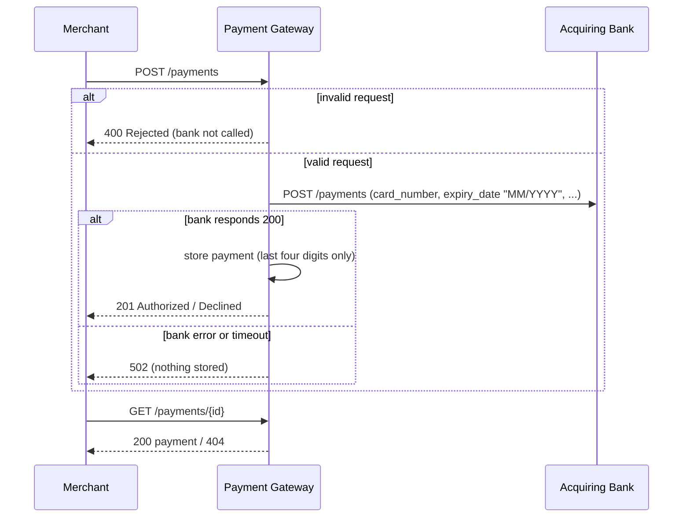

# Payment Gateway

A payment gateway API built with Spring Boot. Merchants use it to process card payments through an acquiring bank and to look up those payments afterwards.

- [Running it](#running-it)
- [API](#api)
- [How it works](#how-it-works)
- [Design decisions and assumptions](#design-decisions-and-assumptions)
- [Observability](#observability)
- [Testing](#testing)
- [What I'd do next](#what-id-do-next)

## Running it

**Requirements:** JDK 17 and Docker.

| What | Command |
|---|---|
| Everything in Docker (gateway and bank simulator) | `docker compose up --build` |
| Gateway locally, simulator in Docker | `docker compose up bank_simulator`, then `./gradlew bootRun` |
| Build and run all tests | `./gradlew build` |

The gateway listens on **http://localhost:8090**. Interactive API docs (Swagger UI) are at **http://localhost:8090/swagger-ui/index.html**.

The simulator decides the outcome from the last digit of the card number:

| Last digit | Result |
|---|---|
| 1, 3, 5, 7, 9 | Authorized |
| 2, 4, 6, 8 | Declined |
| 0 | Bank error |

```bash
curl -i -X POST localhost:8090/payments -H 'Content-Type: application/json' -d '{
  "card_number": "2222405343248877", "expiry_month": 4, "expiry_year": 2030,
  "currency": "GBP", "amount": 100, "cvv": "123" }'
```

## API

| Method | Path | Purpose |
|---|---|---|
| `POST` | `/payments` | Process a payment |
| `GET` | `/payments/{id}` | Retrieve a payment |

### Process a payment: `POST /payments`

Request:

```json
{
  "card_number": "2222405343248877",
  "expiry_month": 4,
  "expiry_year": 2030,
  "currency": "GBP",
  "amount": 100,
  "cvv": "123"
}
```

Validation rules:

| Field | Rule |
|---|---|
| `card_number` | Required. 14-19 digits only |
| `expiry_month` | Required. Between 1 and 12 |
| `expiry_year` | Required. Month and year together must not be in the past |
| `currency` | Required. One of `USD`, `GBP`, `EUR` |
| `amount` | Required. A positive whole number in minor units (`1050` means 10.50) |
| `cvv` | Required. 3-4 digits only |

Response when the bank authorizes or declines the payment: **`201 Created`**, with a `Location: /payments/{id}` header and this body.

```json
{
  "id": "fa35609c-b0a0-4d2f-ace7-7526753167ba",
  "status": "Authorized",
  "card_number_last_four": "8877",
  "expiry_month": 4,
  "expiry_year": 2030,
  "currency": "GBP",
  "amount": 100
}
```

The same shape comes back for a declined payment, with `"status": "Declined"`.

### Retrieve a payment: `GET /payments/{id}`

Returns the same body as above with **`200 OK`**, or **`404 Not Found`** if no payment has that id.

### Status codes

| HTTP status | Meaning | Body |
|---|---|---|
| `201 Created` | The bank **Authorized** or **Declined** the payment, and it was stored | Payment |
| `200 OK` | Payment found | Payment |
| `400 Bad Request` | The payment was **Rejected** as invalid. The bank was not called and nothing was stored | `{"status":"Rejected","message":"Invalid payment request","errors":["cvv must be 3-4 digits"]}` |
| `404 Not Found` | No payment with that id | `{"message":"Payment not found"}` |
| `502 Bad Gateway` | The bank failed or timed out. No payment was created and it is safe to retry | `{"message":"Acquiring bank unavailable, please retry later"}` |

Every response carries an `X-Request-Id` header. If the merchant sends one, it is echoed back; otherwise the gateway generates one. The same id appears in every log line for that request.

## How it works



Code layout, under `com.checkout.payment.gateway`:

| Package | Contents |
|---|---|
| `controller` | HTTP endpoints and OpenAPI annotations. No business logic |
| `service` | The payment flow: call the bank, map the result to a status, store the payment, record a metric |
| `client` | `BankClient` and the bank's own request/response format. The bank's contract is kept separate from ours |
| `validation` | The "expiry date is in the future" rule. It uses an injected `Clock`, so tests can control the date |
| `exception` | Maps exceptions to the HTTP responses in the status code table |
| `repository` | In-memory, thread-safe payment store (a `ConcurrentHashMap`) |
| `filter` | Assigns a request id to every request for log correlation |

## Design decisions and assumptions

### API design

- **One resource, `/payments`.** `POST` creates a payment and `GET /payments/{id}` reads it. The POST response and the GET response have the same shape: both are simply "the payment".
- **Field names are snake_case**, the same style as the bank simulator and Checkout.com's public API.
- **`201 Created` for both Authorized and Declined.** A declined payment is still a payment that was created. Its outcome is in `status`, not in the HTTP code.
- **Rejected payments get `400` and are never stored.** The spec says no payment is created when information is invalid. The response says `"status": "Rejected"` and lists every validation error at once, using the merchant's own field names, so they can fix everything in one go.
- **Bank failures get `502 Bad Gateway`.** The gateway itself is healthy; the service behind it failed. The response is distinct from Declined, so a merchant never mistakes "the bank was down" for "the card was refused".
- **Payment ids are random UUIDs.** They can't be guessed or enumerated. An id that isn't a valid UUID returns `404` rather than `400`, because either way no payment exists at that URL.

### Card data and security

- **The full card number and CVV are never stored, returned or logged.**
  - Only the last four digits are kept, as a string, so a leading zero survives (`"0123"`).
  - The request objects override `toString()` to mask card data, because RestTemplate prints request bodies when debug logging is on.
  - Validation errors never repeat the rejected value back to the merchant.
- **Fractional amounts are rejected.** By default, Jackson would silently turn `10.5` into `10`, so this is switched off (`accept-float-as-int=false`).
- **A client-supplied `X-Request-Id` is accepted only if it is safe.** It must match `[A-Za-z0-9-]{1,64}`, because it is written into the logs and could otherwise be used to forge log lines.

### Assumptions

- **Expiry date.** A card is valid until the end of its expiry month, so the current month is accepted. "Now" is taken in UTC.
- **Currencies.** The spec allows at most three ISO codes, so I chose `USD`, `GBP` and `EUR`. They must be uppercase.
- **Amount.** It must be a positive whole number of minor units, so `0` is rejected. It is stored as an `int`, which is enough for this exercise.
- **No Luhn check.** The spec doesn't ask for one, and it could reject the simulator's test card numbers.
- **The bank's reply is the only source of truth.**
  - A `200` from the bank with `authorized: true` means Authorized, and `authorized: false` means Declined.
  - Anything else (a `4xx` or `5xx` response, a timeout, or an empty body) counts as a bank failure.
  - Timeouts: 2 seconds to connect, 10 seconds to read. Both can be configured.
- **Storage is in memory, as the spec allows.** Payments are lost on restart and aren't shared between instances.
- **Merchant authentication is out of scope.**

## Observability

| Signal | Where |
|---|---|
| Liveness and readiness | `/actuator/health/liveness`, `/actuator/health/readiness`. These suit Kubernetes probes and the Docker `HEALTHCHECK` |
| Build and version info | `/actuator/info` |
| Metrics, in Prometheus format | `/actuator/prometheus` (see below) |
| Logs | Every log line includes the request id, e.g. `INFO [smoke-test-1] ... Payment fa35609c... Authorized: 100 GBP` |

Metrics:
- `payments_processed_total{status="Authorized" or "Declined"}` counts outcomes, to track the authorization rate.
- `http_server_requests_seconds` gives our own latency and error rate, broken down by status code. Rejections show up here as `400`s.
- `http_client_requests_seconds` gives the bank's latency and its error responses.

Log levels:
- **INFO** for payment outcomes and rejections. These are expected events.
- **ERROR**, with the stack trace, for bank failures. These need attention.

## Testing

`./gradlew build` runs 55 tests in four layers.

| Test class | Type | What it covers |
|---|---|---|
| `PaymentGatewayControllerTest` | Full Spring context with MockMvc. Only `BankClient` is mocked | The API contract: status codes, JSON field names, the `Location` header, a POST followed by a GET, every validation rule and its boundaries, malformed JSON, fractional amounts, bank failure becoming `502`, and the request id. It also checks that card data never appears in a response |
| `BankClientTest` | `MockRestServiceServer` | The exact JSON sent to the bank (snake_case, zero-padded `MM/YYYY` expiry), reading its response, and treating `400`, `500`, `503` and timeouts as bank failures |
| `PaymentGatewayServiceTest` | Plain unit test | Status mapping, storing only the last four digits (leading zeros kept), nothing stored when the bank fails, and the metrics |
| `FutureExpiryDateValidatorTest` | Plain unit test with a fixed `Clock` | Expiry boundaries: the current month is valid and the previous month is not |

The whole system was also checked by hand with `docker compose up` against the real simulator:
- A card ending in an odd digit came back Authorized.
- An even digit came back Declined.
- A card ending in 0 gave a `502`.
- An invalid card number was Rejected.

## Packaging and CI

- **Dockerfile.** Built in two stages:
  1. A JDK image builds the jar, with Gradle's cache kept between builds.
  2. The jar runs on a slim JRE image as a non-root user, with a health check.
  
  The JVM is sized from the container's memory limit (`MaxRAMPercentage`).
- **Configuration through environment variables.** For example, `BANK_URL` points the gateway at the bank; Compose sets it to the simulator's container.
- **GitHub Actions** (`.github/workflows/build.yml`) builds, runs the tests and builds the Docker image on every push and pull request.

## What I'd do next

These would come before production, roughly in priority order:

1. **Idempotency keys.** Accept an `Idempotency-Key` header so a merchant can safely retry after a timeout or a `502` without being charged twice.
2. **Handle "unknown" bank outcomes.** After a read timeout, the bank may in fact have authorized the payment. Store the payment as `Pending` before calling the bank, and settle it later by reconciliation or by voiding it.
3. **A real database** in place of the in-memory store, plus merchant authentication, so merchants can only see their own payments.
4. **Resilience.** Add a circuit breaker and bulkhead around the bank call. Avoid automatic retries unless idempotency is in place.
5. **Better telemetry.** Add OpenTelemetry tracing that passes trace context on to the bank, write logs as JSON, and serve actuator endpoints on a separate management port.
6. **API versioning**, such as `/v1/payments`. Possibly also standard error bodies following RFC 7807 (Problem Details).
